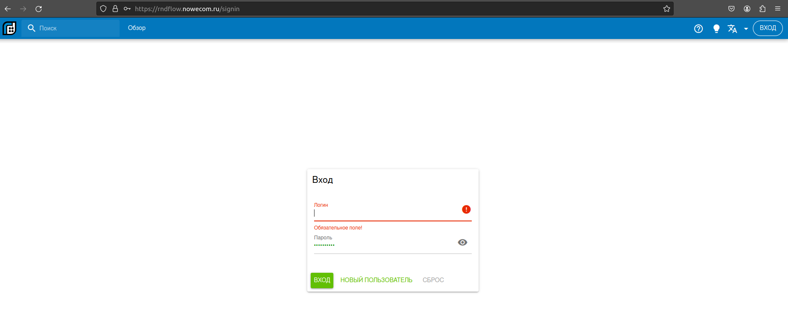
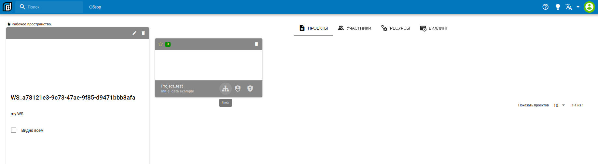
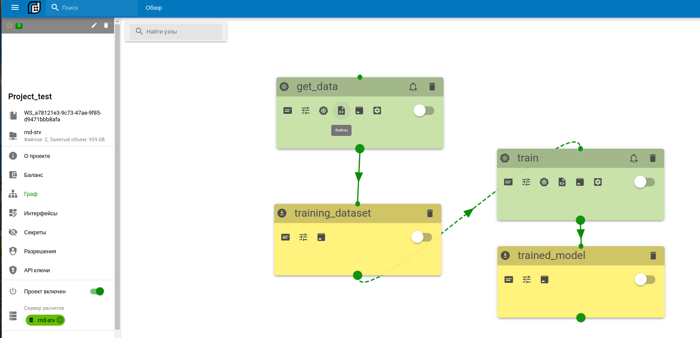

# Работа с платформой

## Вход

- Войдите со своими учётными данными [Вход](https://rnd-srv.nowecom.ru/signin)

- Нажмите на кнопку **Обзор** и на вкладке проекты выберите проект с названием *Project_test* и нажмите кнопку **Граф**.

.

- Вы увидите граф проекта.

- Первый узел **get_data** настроен на получение исходных данных.
- Узел **train** то с чего вам стоит начинать работу.
- Справка по работе с платформой [тут](https://rnd-srv.nowecom.ru/docs/).
