# Работа с платформой

## Регистрация и вход

- Зарегистрируйтесь на сайте [RnDFlow](https://rndflow.nowecom.ru/signup).

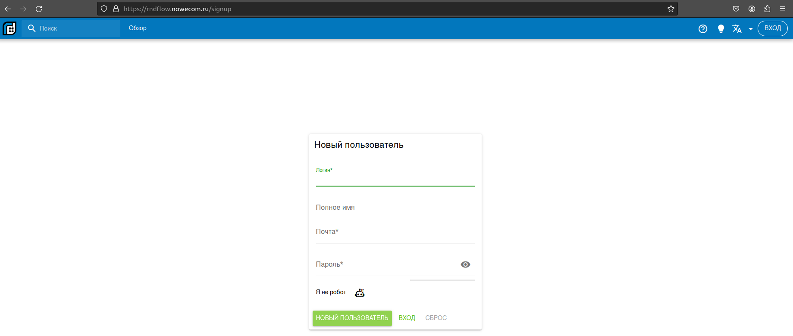

- Войдите со своими учётными данными [Вход](https://rndflow.nowecom.ru/signin)

- Зайдите в профиль (выберите зелёную иконку в правом верхнем углу) и выберите пункт меню с именем которое вы указали при регистрации.

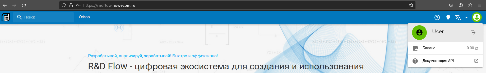

## Создание и настройка рабочего пространства

- Создайте рабочее пространство, нажав на + справа от надписи "Рабочие пространства".

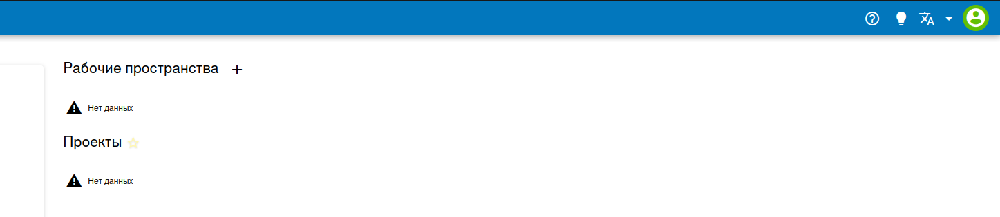

- Укажите имя рабочего пространства (желательно фамилию и имя, чтобы службе поддержки было проще отыскать ваш проект).

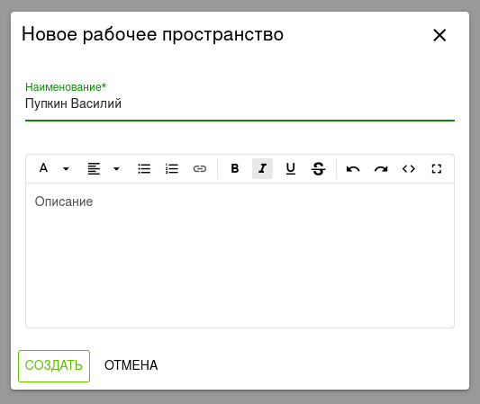

- Перейдите в созданное рабочее пространство нажав на плитку с названием вашего рабочего пространства.

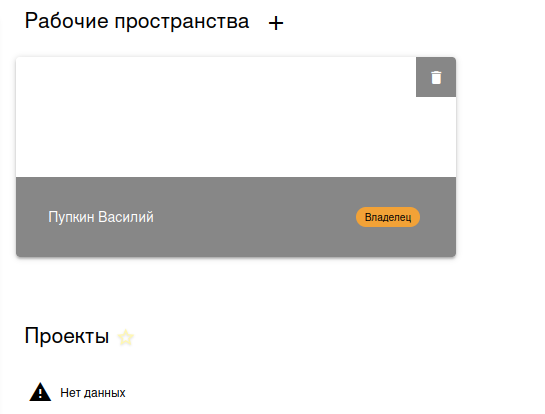

- Преейдите на вкладку **Ресурсы**.

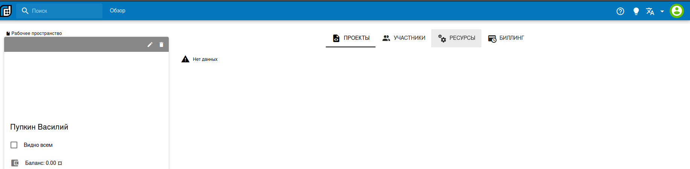

- Добавьте сервер S3, нажав на значок лупы справа от надписи **"S3 серверы"** и выбрав его название из выпадающего списка.

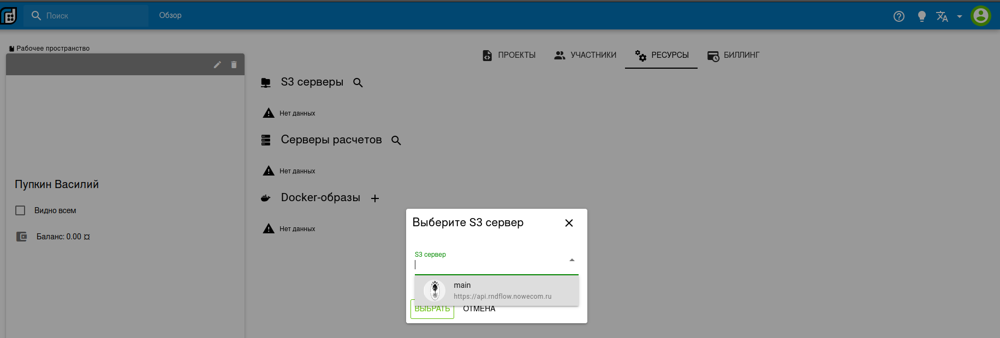

- Добавьте сервер расчётов, нажав на значок лупы справа от надписи **"Серверы Расчётов"** и выбрав его название из выпадающего списка.

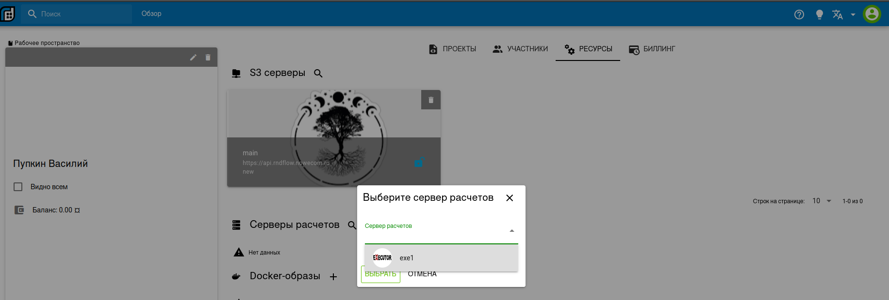

- Перейдите на вкладку **Проекты** выбрав соответствующую кнопку вверху.

## Создание проекта

- Создайте проект нажав красную круглую кнопку со знаком + в правой нижней части экрана.

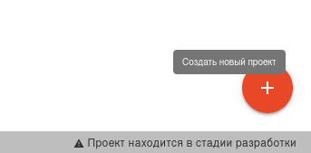

- Задайте имя проекта и выберите S3 сервер из выпадающего списка.

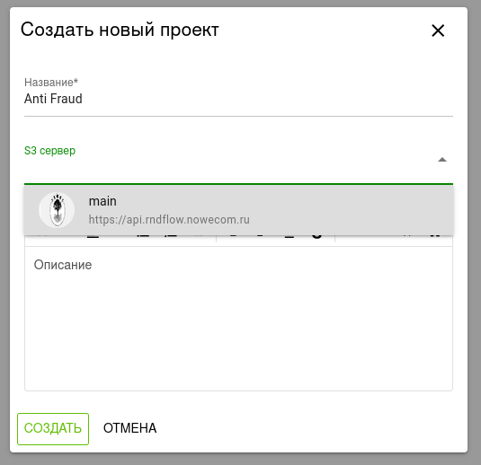

- Зайдите в созданный вами проект нажав на плитку с его названием.

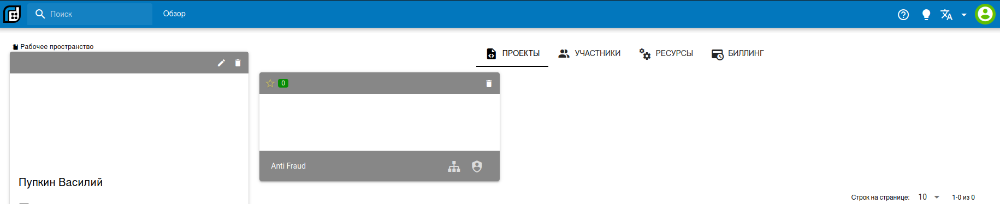

- В левой части экрана включите переключатель **"Проект включен"**, укажите сервер расчётов и включите переключатель **"Слой данных включен"**.

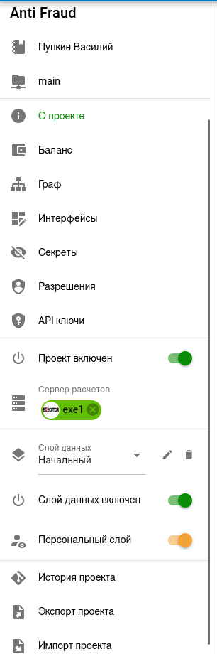

- Можно начинать работу создавая узлы и связи.
- Справка доступна в верхнем правом углу или по ссылке [Документация](https://rndflow.nowecom.ru/docs/).

## Шаблон проекта (опционально)

Для ускорения процесса знакомства с платформой мы сделали [шаблон проекта](./data/Data.tar) который можно загрузить (нажав кнопку **Импорт проекта**). В шаблоне настроен первый узел с загрузкой данных.
